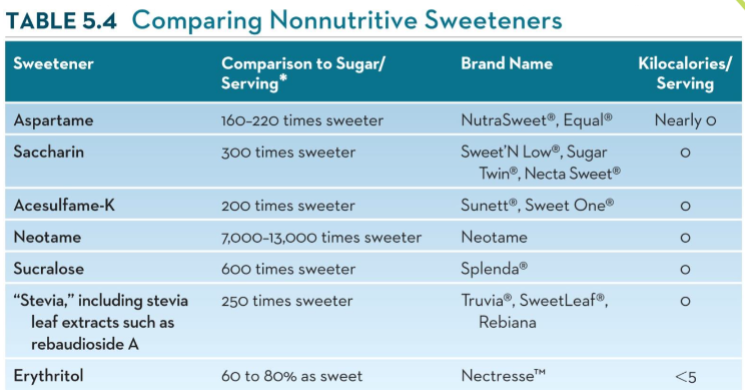
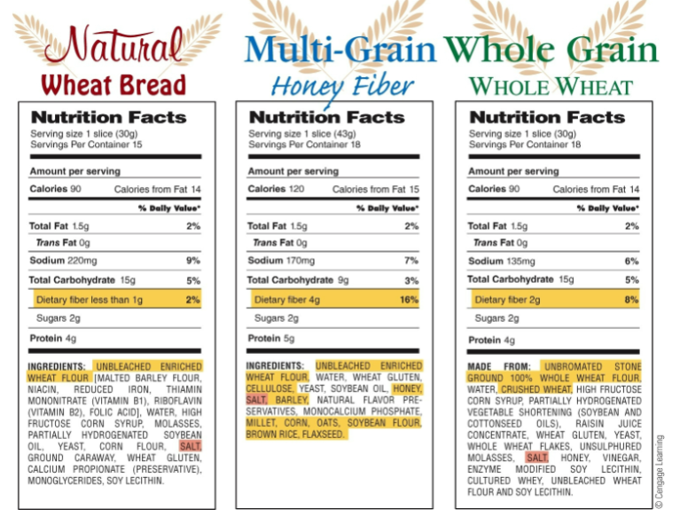

# Chapter 5: Carbohydrates (sugars, starches, and fiber)

plants are sources of carbs (CHO)
plants make CHO from CO_2 and H_2O (photosynthesis)

## sources of carbs
- fruits  
- grains  
- vegetables  
- milk  
- added sugars (sugar, honey, corn syrup, etc)  

## carbohydrates  
|simple| complex|  
|--|--|  
|monosaccharides|polysaccharides (20+ monosaccharides)|  
|disaccharides|oligosaccharides (3-10 monosaccharides, raffinose(3), stachyose (4))  

### condensation to form dissacharides  

### simple carbs - dissacharides 
glucose + glucose = maltose (ex: beer, least common)  
glucose + fructose = sucrose (ex: table sugar, most common)  
glucose + galactose = lactose (ex: milk)  

### comparing sweeteners  
most non-chemical sweeteners are pretty similar in terms of nutrition content. Chemical sweeteners have close to 0 kcals/serving.  
  
  

## complex carbs: starch and glycogen

|starch|glycogen|  
|--|--|  
|storage form of CHO for plants|storage form of CHO for animals|  
|found in wheat, barley, rice, oats, vegetables, potatoes|stored in the muscles and liver|  

## complex carbs: fiber  
- humans don't have the enzyme needed to break down fiber  
- found only in plant foods  
- supportive structures and seed coatings  
- not digested in humans  
- metabolized by gut microbiota  
- eliminated in feces  

health benefits and traits:  
|soluble fiber|insoluble|  
|--|--|  
|dissolve in water (ex: pectin, gums)|do no dissolve in water (ex: cellulose, lignan)|  
|food sources: oat bran, oatmeal, beans, apples, carrots, oranges, psyllium| food sources: whole grains like brown rice|  
|decreased cholesterol|more regular bowel movements|  
|decreased blood pressure| |  
|decreased inflammation| |  

make half of your grains whole. tips:  
- brown color does not mean whole wheat  
- multi-grain, stone ground, etc. do not mean whole grain  
- high fiber does not mean whole grain  
- any ingredient listed after salt is probably less than 1 tsp  

### carb consumption patterns  
- about 50% of kcals are from carbs in the US, and more than the recommended amount of added sugars are consumed  
- 20% from sugars (it is recommended that americans consume less than 10%)  
  

## CHO digestion  
- mouth  
    - salivary amylase (results in smaller chains)  
- stomach  
    - fiber present in food would delay rate at which chyme empties from the stomach  
    - promotes satiety (fullness)  
- small intestine (main site for digestion and absorption)  
    - pancreatic amylase  
    - brushborder enzymes (released from the lining of the small intestine)  
- large intestine  
    - soluble fiber is fermented by bacteria  
    - insoluble fiber is not digested; contributes to softer feces and decreases risk for constipation  

CHO is absorbed as monosaccharides and transported to the liver via the hepatic portal vein. In the liver, galactose and some fructose are converted into glucose.  

## brushborder enzymes  
- maltase breaks down maltose  
- sucrase breaks down sucrose  
- lactase breaks down lactose  

## sources of glucose  
- food  
- glycogen (glycogeno*lysis*)  
- make new glucose (gluco*neo**genesis***)  

## fates of glucose  
- cells need energy = glucose is used for energy  
- fed state = glucose is stored as glycogen  
- excess = glusoce is converted to fat and stored  

## Insulin  
- after we have eated and blood glucose rises:  
    - *in*sulin secreted from the pancreas  (gets glucose *in* to the cells)  
    - lowers blood glucose  
- also promotes building/storage  
    - glycogen storage  
    - protein synthesis  
    - lipid storage  

## Glucagon  
- pancreas secretes glucagon when we haven't eaten in a while (and blood glucose starts to drop)  
- helps raise blood glucose  
- promotes  
    - glucogenolysis  
    - gluconeogenesis  
        - break down protein and fat (may lead to keytone formation)  

## Keytones  
- when available, cells metabolize glucose for energy  
- inadequate supply of CHO  
    - fat is converted to keytones (molecules formed from the metabolism of fat that can be used as an alternative fuel for certain cells in the body when glusoce is low)  
    - ketosis (safe but can give you bad breath)  
    - ketoacidosis: accumulation of keytones (can result in loss of consciousness or death in individuals with type 1 diabetes)  

fun fact! the keytones building up also supresses appetite, which is why if you are hungry for long enough you stop feeling hungry.

## Diabetes  
|blood glucose level (fasting)|classification|  
|--|--|  
|<70 mg/dl|hypoglycemia|  
|70-90 mg/dl|normal|  
|100-125 mg/dl| pre-diabetes|  
|126+ mg/dl|diabetes|  

### signs and symtpoms of Diabetes Mellitus  

### Type 1 diabetes  
- autoimmune disease  
    - influenced by a variety of genetic and environmental risk factors  
- insufficient insulin production  
    - treatment: insulin injection/pump required

### Type 2 diabetes  
- insulin resistant  
- most cases in the US are type 2  
- risk factors  
    - physical inactivity  
    - overweight  
    - family history  
    - hispanic, native american, asian, african, or pacific islander ancestry  
- treatment: carb controlled diet, exercise, medication, insulin may be required  

## Lactose Intolerance
- insuffiecient lactase  
- symptoms: bloating, gas, diarrhea  
- more prevalent in:  
    - adults  
    - people of african, asian, hispanic, indian, or native american descent

### Managing lactose intolerance  
- consume lactose-containing foods with other foods  
- spread intake out throughout the day  
- fermented products  
- lactaid  

## Fiber and health  
- diets high in fiber may decrease risk of  
    - constipation  
    - obesity  
    - type II diabetes  
    - intestinal tract disorders including colorectal cancer  
    - heart disease and stroke  
        - lowering blood pressure, reduced inflammation, blood lipid levels  

adequate intake for fiber is:  
- 38 g/day for men  
- 25g/day for women  
- typical diet supplies 16g/day  

## soluble fiber can lower cholesterol  
- cholesterol is a component of bile  
- fiber traps cholesterol in the small intestine  
- bile is then excreted  
- the next time the body need to digest fat, cholesterol is pulled from the blood to make bile in the liver  
- bile can help decrease blood cholesterol and risk for heart disease  