# Human-Nutrition
# **08/28/2025**
exams will be open from tues to sat on the week they are due, get 2 attempts on the final

## intuitive eating: finding moderation with food
### why diet mentality doesnt work
    - externally motiviating instead of intrinsically motiviating
    - ppl tend to make drastic changes in their food intake and lifestyle, which makes it hard to adjust to
    - seen as temporary, strict changes that are not meant to be sustainable
    - focuses on taking away instead of adding to 
    - label foods as 'good' or 'bad'
    - don't get to the root of the problem (ex: sedentary lifestyle, causes of overeating (habits, trauma), underlying health issues such as hormone imbalances)
    - diets are difficult to take on the road, or to upkeep in busy lifestyle 
    - focuses on weight loss, not wellness. this can lead to more weight being gained than was lost during the diet

### intuitive eating focuses on additions rather than subtractions
    - adding eating times (optimal every 3-4 hours)
        even if it a small amount of food, this can help people feel properly fueled
        this can also depend on the person, and how much they eat at once. some people feel better with more small meals, and some would rather have a few larger ones
    - variety helps the food feel interesting and exciting
        meals = 3 food groups
        snacks = 2 food groups
    - fruits and veggies tend to be underrepresented in a lot of american's diets
    - water! chronic dehydration is A Thing
    - physical activity, 1 hr for every 8 hours sedentary

## understanding hunger and fullness
    0   : empty  
    1.5 : ravenous  
    3   : weak  
    4   : pangs  
    5   : neutral  
    6.5 : satisfied  
    8   : full  
    9   : stuffed  
    10  : sick  

    goal is to stay between 3-7, and going to one of the extremes can cause you to swing to the other extreme

### strategies to notice fullness
    - the food stops tasting as good, not getting enjoyment from it, texture starts to bother you
    - take mini breaks when eating
    - learn from history (if you get a serving of food and feel too full after eating it, make a mental note that next time you would prefer a smaller serving)

### emotional eating
    ask yourself:
        am I hungry?
        how am I feeling?
        what do I need?
    it's not that we can never eat when we aren't hungry, but it shouldn't be a frequent thing or get to the point of impacting our feelings of wellness
    top reasons for emotional eating: boredom, stress, lonely, tired, want a reward, habits/environmental queues  

**power snacks:** ideally want to have a protein (lasting energy) and a carb (quick energy)

*key note:* food does not have a moral value! there are not 'good' vs 'bad' foods, and you are not good or bad for eating foods. All foods can have a place in a balanced diet, but some are 'sometimes' foods that do not provide as much value to you

### body acceptance
    negative filtering: focusing on a negative aspect to the point that is drowns out all other things
        tip: leave with one good thing (before starting your day, or each time you think about your body, end with a positive thing)
        focus on what your body can do

# **09/02/2025** ch 1

- nutrients are life sustaining substances found in food
    necessary for growth, maintenance, and repair of body cells

- nutrition is the scientific study of nutrients and how the body uses them

## why study nutrition?
- poor dietary practices are associated with obesity and type II diabetes
- healthy diets support longer, healthier lives

## characteristics of nutrients
the nutrients:
- vitamins
- minerals
- fat
- protein
- carbohydrates
- water

nutrients are sources of elements (substance that cannot be separated into simpler substances by ordinary chemical or physical means) needed by the body

### ways to classify nutrients:
- organic (contains carbon)
- non essential (nutrients synthesized in the body from raw materials from food)
- essential (must come from food)
- energy yielding

### six classes of nutrients

vitamins: organic, found in produce and grains

minerals: major (large amounts, such as calcium in teeth, rec 1200 mg/day) or trace (smaller amounts, such as iron in red blood cells, rec 8-30 mg/day)

fat: organic, energy yielding, helps the body insulate and protect itself

protein: organic, can be from plant of animal sources, important role in muscle building and maintenance, hormones are also protein

carbs: organic, energy yielding, preferred fuel source for brain and muscles, found in fruit/grains/dairy products

water: found in all drinks and most foods, important for cooling and cushioning in the body, helps remove waste from the body

### phytochemicals
- substances in plants that are not nutrients but may have health benefits
    - caffine
    - beta-carotene
    - organosulfides
    - nicotine (not beneficial)

### deficiency
- deficiency disease occurs when the body lacks a nutrient
- signs: observable physical changes (such as bleeding gums for vitamin c deficiency)
- symptoms: subjective complaints of ill health (tiredness for iron deficiency) 

## calories vs Calories
a calorie is the amount of heat needed to raise the temp of 1mL of water 1 degree C
    - this is a very small unit if measurement, so food energy is measured in 1000 calorie units

a kilocalorie (or Calorie) is the heat energy needed to raise 1L of water 1 degree C

### example: apple
1 apple = 40,000 calories = 40 kcals = 40 Calories

## energy yielded from nutrients
1g carbs = 4 kcals  
1g protein = 4 kcals  
1g fat = 9 kcals  
1g alcohol = 7 kcals  
1g lipids = 9 kcals  

## **Lifestyle factors that impact health**

### Chronic Disease
Chronic diseases are long term conditions that usually take years to develop and have complex causes.  
- heart disease
- diabetes
- cancer

### Risk Factors
Risk factors are personal characteristics that increase a person's chances of developing a chronic disease.  

- family history  
- unsafe environmental conditions  
- psychological factors  
    - emotional stress  
- social determinants of health  
    - access to good food and healthcare  
- advanced age  
- unhealthy lifestyle  

**General rule:** for every 8 hours of sedentary time, do 1 hour (or more) of physical activity

being sedentary for more than 8 hours a day without physical activity has a mortality risk comparable to smoking :(

### 'healthy people 2030' project
This project is a list of goals (updated every 10 years) issued by the department of health and human services to promote health and prevent disease.

main takeaways for 2030:  
- limit food and beverages high in added sugars, saturated fat, and sodium  
- increase intake of fruit, vegetables, whole grains, calcium, potassium, vitamin D  

## factors that influence eating habits

- what was the last thing you ate today?  
    - WHERE were you?  
    - WHO were you with?  
    - HOW hungry were you?  
- what factors influenced  
    - WHAT you ate?  
    - WHY you ate?  
    - HOW much you ate?  

### Biological and physiological factors
- sensory information  
- rate of growth (increased hunger levels)
- things like budget, time available for cooking, general health, etc  

### Cognitive and psychological factors
- past experiences  
- cultural practices  
- religious teachings  
- things learned at school, home, media, internet  
- emotional stress level and mood  
- positive and negative associations  

### Environmental factors
- cost  
- proximity/accessibility to food/stores/kitchen  
- government policies (subsidization)  
- food distribution and availability  
- food marketing  
- store layout  

### Expert advice factors
- registered dietitian nutritionists  
    - college trained healthcare professional who has extensive knowledge of foods, nutrition, dietetics, and the application of nutrition and food info to achieve and maintain optimal health
- master's degree 
- extensive supervised practice hours  
- pass national registration exam  
- complete ongoing continuation education  

## Key nutrition concepts
- most foods are mixtures of nutrients  
- variety, moderation, and balance can help ensure a diet's nutritional adequacy  
- food is the best source of nutrients  
- foods and the nutrients they contain are only one of many components of health  
- malnutrition includes overnutrition as well as undernutrition  
- nutritian is a dynamic science

### nutrient density
nutrient dense foods have:
- more key nutrients relative to its total kcal per serving  
- less solid fat, added sugars, refined starches  

to find the nutrient density, divide the amount of nutrients by the kcals.  
ex:  
whole milk has 300mg calcium / 140 kcals = 2.14 mg Calcium per kcal  
skim milk has 300 mg calcium / 80 kcals = 3.75 mg Calcium per kcal  

### energy density
- amount of energy (kcals) a food provides per given weight of food  
- energy dense food often have empty kcals (kcals from unhealthy solid fats and added sugars)

## **9/9/2025**, ch 1 cont.
participation points (must have 100 pts by end of semester) can be from attendance, cooking demos on campus (have to register for these), or a 1 on 1 dietician consultation (also have to sign up for a time slot). Can only get points for 1 demo/session a month.

## Calendar check in: 
    assignment 2 and workbook 2 are due this saturday
    first exam is due on sat sep 27th, will open on the 23rd. open book open notes, but check if need to print/email to yourself, etc
    resources page has study guides, practice questions, and a practice exam

## variety, moderation, balance  
- variety: each food group  
- moderation: reasonable amounts  
- balance: supports maintenance of a healthy weight  

## food is the best source of nutrients

| Food | Supplements  |
|----------|----------|
| efficient| convenient   |
| relatively inexpensive    | may fill a nutrient need   |
| contains a mix of nutrients | not regulated by FDA prior to being sold on the market |
| contains phytochemical, etc. | expensive |
| | may contain only one nutrient|
| | high amounts of one nutrient may decrease absorbption of another |

## Malnutrition: under *and* overnutrition
- malnutrition: a state of health that occurs when the body is improperly nourished  
- there are risks with excessive intake *and* under consumption  
- nutritional status does not always correlate with weight  

what are risk factors for malnutrition?
- food deserts or insecurity   
- allergens or food restrictions  
- eating disorders or psychological factors  
- chewing problems  
- limited access to food  

## Nutrition is a dynamic science
- research continues to evolve  
- as such, nutrition recommendations do as well   
- individual needs may vary  

## end of chapter 1, review question
### which of the following is *not* a key nutrition concept?
a. Foods and the nutrients they contain are not cure-alls.  
b. ***The best way for people to obtain all the essential nutrients is
to consume dietary supplements.***  
c. Variety, moderation, and balance can help ensure a diet's
nutritional adequacy.  
d. Malnutrition includes over-nutrition as well as
undernutrition.  

# **Ch. 2 Evaluating Nutrition Info**
## The scientific method
1. Observation  
2. Hypothesis  
3. Literature review  
4. Experiment  
5. Analysis and interpretation  
6. Dissemination
7. Conduct more research  

Anecdote = account/testimonial of a personal experience or event

## Follow up questions/evaluating research considerations:
- was the hypothesis supported?  
- do we have enough information to establish a theory?  
- did they have a control group?  
- was there randomization?  
- what is the sample size?
    - typically larger is better  
    - mention of a sample size/power calculation is preferred  
- what is the p-value?  
    - p-value <0.05 indicates statistical insignificance  
        - indicates that there is less than a 5% chance that the findings were due to chance  

## Publishing research
- peer review  
- parts of a research article  
    - abstract  
    - review of literature  
    - methodology  
    - results  
    - conclusions  
    - references  

## sample size / power calculation
- The sample size and power calculation were
calculated on the following assumptions: an
incidence rate in the low-fat group of 4 events per
100 person-years that would amount to 24·9% of
absolute cumulative incidence after 7 years, a
hazard ratio (HR) of 0·7, and statistical power of
80%, with two-tailed α=0·05. Under these
assumptions, the required sample size was 491
patients in each of the two groups

## P-value
- in men...primary endpoints occurring in 67
(16.2%) of 414 men in the Mediterranean diet
group versus 94 (22.8%) of 413 men in the low-fat
diet group (multiadjusted HR 0.669 [95% CI 0.489–
0.915], log-rank p=0.013)  
- There was no differences when comparing the two
diets among women (p=0.25)  

## Review  
A study assesses the change in knowledge following
an educational intervention. Which of the following
groups had a statistically significant improvement in their knowledge?  
A. Older adults (4.5±1.25 to 4.6±1.36, p=0.87)  
B. ***College students (3.9±0.6 to 5.9±1.6, p=0.03)***  
C. High school students (4.1±1.56 to 5.7±5.5,
p=0.51)  
D. Elementary school students (1.2±2.5 to 1.1±3.2,
p=0.67)  

## Types of research studies
### Lab Research: Test tube studies (in vitro)
| Type of study/definition | Pros | Cons |  
|----------|----------|----------|
|Studies performed in a test tube allow scientists to study the effect of a specific nutrient on a specific cell type in controlled environment | controlled environment | results from a test tube may not be observed in a human |  
| | few confounding variables | |   
| | relatively expensive | |  

**Confounding variables** – factors that are not
being studied may influence the outcome of
the research  

### Lab Research: animal studies (in vivo)
| Type of study/definition | Pros | Cons |  
|----------|----------|----------| 
|Because of safety and ethical concerns, nutrition scientists often conduct experiments on animals before performing similar research on humans | preliminary research is done on animals instead of humans | results from animal studies may not be observed in a human study|
| | helps inform future studies with humans| |  

### Lab Research: observational studies
| Type of study/definition | Pros | Cons |  
|----------|----------|----------| 
|Epidemiology is the study of the occurrence, distribution, and factors that may contribute to health problems in populations | inform future experimental (intervention) studies | observational studies cannot establish cause-effect relationships |
|phsical health data | | healthy-user bias |
|surveys | | |

types:
- cross-sectional
- case-control
- cohort

### Observational studies: Cross-sectional
- looking at a "snapshot" of one point in time
- identify factors that may influence disease in a certain population

### Observational studies: case control
- individuals with a health condition (cases) are compared to individuals with similar characteristics who do not have the condition (controls)  

### Observational studies: Cohort
- in a cohort study, epidemiologists collect and analyze various kinds of information about a large group of people over time
    - retrospective or prospective

### Human Research: Experimental studies
| Type of study/definition | Pros | Cons |  
|----------|----------|----------| 
|In experimental studies, cetrain aspects of the diet are changed, and health outcomes are assessed | gold standard = randomized controlled trails (RTCs) | specific inclusion criteria may decrease generalizability |  
|specific inclusion criteria |  | real life does not have controlled, ideal conditions |

## **9/11/2025**

## Correlation types
positive correlation: A and B increase or decrease in the same direction  

Negative correlation: A and B increase or decrease in opposite directions  

  

## levels of research evidence
  

## Review: what type of study?
  
a: cross-sectional  

  
a: cohort  

  
a: human (clinical) trial  

## Review: what type of correlation?
  
a: positive correlation  

  
a: postitive correlation (note that positive correlation does not always mean positive outcome)

## **Nutrition info: fact or fiction**

### Features of unreliable sources of nutrition info
1. promises of quick and easy remedies  
2. claims that sound too good to be true  
3. scare tactics  
4. attacks on conventional scientists and nutrition experts  
5. testimonials  
6. promotion of benefits while overlooking risks  
7. vague, meaningless, or scientific-sounding terms  
8. vague sources  
9. pseudoscience  
10. disclaimers  

### Finding credible sources of nutrition info
- motivation  
    - health promotion vs selling something  
    - .com vs .org or .gov  
    - nationally recognized health organization?  
- source  
    - nutrition expert vs PhD  
    - reviewed by experts vs blogs or magazines  
- evidence based?  
    - references to pertinent, high quality, peer reviewed research?  
        - population similar to me?  

## Review : credible sources of nutrition info
Which of the following is NOT an indication that the source of information is credible?  
a) ***Provides testimonials***  
b) References peer-reviewed journal articles  
c) Can be found at a .edu website  
d) Is written by a registered dietitian  

# **Ch. 3 Basis of a healthy diet**

## Nutrient Requirements
- smallest amount of a nutrient that maintains a defined level of nutritional health  
- consuming the recommended amounts of nutrients can support maintenance of nutrient storage and help prevent deficiency  
- many factors can influence nutrient needs  
    - age  
    - sex  
    - lifestyle  
    - general health status  
    - illness  

## Nutrient and calorie standards  
**Dietary Reference Intakes (DRI)**  
Nutrition experts review thousands of research studies to develop standards for energy, nutrients, etc. that best support health.  

### Important notes about DRI
- varies by age, gender, life stage  
- aim to reduce risk of chronic disease and avoid unhealthy excess  
- should be used as a *guide* for overall intake of food over time  

- estimated average requirement (**EAR**)  
    - meets the needs of 50% of population  
    - used to calculate RDA  
- Recommended Dietary Allowance (**RDA**)  
    - EAR + a margin of safety  
    - meets the needs of 97%-98% of the population  
- Tolerable Upper Level Intake (**UL**)  
    - exceeding this amount may result in toxicity  
    - may be exceeded with supplements  
    - not likely to be exceeded with food  
- Adequate Intake (**AI**)  
    - not enough research to establish a DRI  
    - amount that healthy populations consume  
- Estimated Energy Requirement (**EER**)  
    - average dietary energy intake (kcals/day) that will maintain energy balance in a person who has a healthy body weight and level of physical activity  

### Acceptable Macronutrient Distribution Range (AMDR)

Range of intakes for the energy nutrients that provide adequate energy and nutrients and reduce the risk of chronic disease.  

- carbs: 45-65% of kcals  
- fat: 20-35% of kcals  
- proteins: 10-35% of kcals  

If John needs 2300 kcals/day, according the AMDR:  
- 2300 * 0.2 = 460 kcals (low end)   
- 2300 * 0.35 = 806 kcals (high end)  
- John should be getting 460-806 kcals from fat  

Steven needs 4000 kcals each day. How many kcals from protein?

4000 * .10 = 400 kcals from protein  
4000 * .35 = 1400 kcals from protein  

How many grams of protein should he consume?  
400 kcals / 4 = 100 grams  
1400 kcals / 4 = 350 grams

## Major food groups  
- grains 
- dairy  
- protein  
- fruits  
- vegetables  
- oils (USDA doesn't count as a separate food group)  

### Enrichment and fortification  
- enrichment is the replacement of some nutrients that were removed during processing  
    - iron (mineral, all the rest in list are vitamins), thiamin, riboflavin, niacin, and folic acid added back into grain products such as white flour or white rice  
    - taken out, then added back in  
- fortification is the addition of nutrients to any food  
    - calcium to orange juice  
    - vitamin A and D to milk  
    - vitamins and minerals to ready-to-eat cereals  
    - stuff that wasn't there originally, but is added in as a helpful extra

## 2020 - 2025 dietary guidelines  
1. follow healthy eating at every stage of life  
2. customize and enjoy nutrient-dense food and beverage choices that reflect personal preferences, cultural traditions, and budgetary considerations  
3. focus on meeting food group needs with nutrient dense foods and beverages, and stay within calorie limits  
4. limit foods and beverages high in added sugars, saturated fat, and sodium, and limit alcoholic beverages

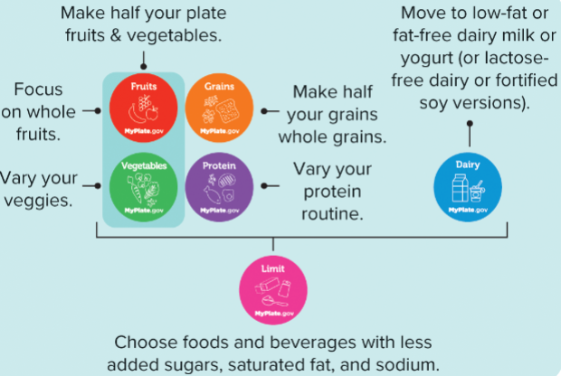

### Major sources of empty kcals  
- cakes, cookies, pastries  
- sugar sweetened beverages  
- cheese and pizza  
- ice cream  
- fatty meats such as sausage, bacon, hot dogs, and ribs  

## Food labels  
- found on most foods other than:  
    - fresh produce and meats  
    - those contributing few nutrients  
        - tea  
        - coffee  
        - spices  
    - foods produced by small businesses  

### Daily values (DVs)
- set of nutrient intake standards developed for labeling purposes  
- the % DV tells you how much a nutrient in a serving of food contributes to a daily diet  
    - 2000 kcal diet is used as the reference  

### Ingredient List  
- **must** list all ingredients  
- listed in descending order by weight  
- gives insight into the nutritional quality of the product  

### Ingredients to watch for  
|sugars| whole grains|  
|------|--------|  
|sugar| oats|  
|high fructose corn syrup |whole grain wheat |  
|honey | brown rice|  
| sucrose| buckwheat|  
| fructose| bulgur|  
| maltose| popcorn|  
|malt syrup | |  
| rice syrup| |  

note: some rounding is allowed on food labels  

### Other label components  
- serving size + servings per container  
- required nutrients  
    - total fat  
        - saturated fat  
        - trans fat  
    - cholesterol  
    - sodium  
    - total carbohydrate    
        - fiber  
        - total sugars  
        - added sugars  
    - protein  
    - vitamin D  
    - potassium  
    - calcium  
    - iron  

### claims on labels
- **nutrient claims:** statements that characterize the quantity of a nutrient in a food  
- examples  
    - "rich in calcium"  
    - "high in fiber"   
- **health claims:** statements that characterize the relationship between a nutrient in a food and a disease  
- example  
    - diets low in sodium may reduce risk of high blood pressure  
- **structure function claims:** statements that characterize the relationship between nutrient and its role in the body  
- ***do not require FDA approval***  
- example  
    - calcium builds strong bones  

# **ch 4 human digestion, absorbtion, and transportation**  

## overview of digestive system  
### primary roles of the digestive system:  
- break down food into nutrients (digestion)  
- absorbtion of nutrients from digestive tract into the blood or lymph for transport to cells  
- elimination of solid waste products  

### Gastrointestinal (GI) tract  
- flexible muscular tube that extends from the mouth to the anus  
- sphincters (circular muscles that are able to close a body opening) help regulate the flow of food particles  
- the innermost layer is called the mucosa  
- the empty space inside this tube is called the lumen  
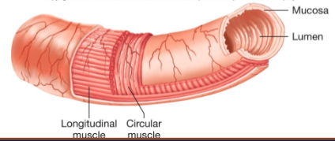  
## order of the GI tract  
- mouth  
    - epiglottis (covers tracea, lets you swallow)  
    - upper esophageal sphincter  
- esophagus  
    - lower esophageal sphincter (sometimes also called the cardiac sphincter)  
- stomach  
    - pyloric sphincter  
- small intestine (*d*uodenum, *j*ejunum, *i*leum)  
    - ileocecal sphincter  
- large intestine (colon)  
    - cecum  
    - rectum  
    - anus  
### accessory organs 
- liver  
- gall bladder  
- pancreas  
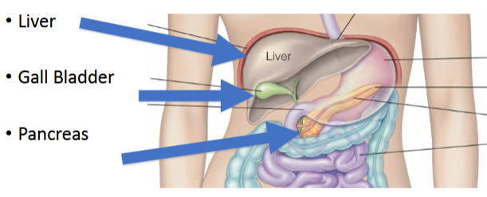  

## digestion of foods into nutrients  
- mechanical digestion  
    - physically breaking down food into smaller pieces  
- chemical digestion  
    - breaking chemical bonds, requires enzymes  
    - digestive enzymes: proteins found in digestive juices that act on food substance, causing them to break down into simpler compounds at a rapid rate  
    - names often end in "-ase"
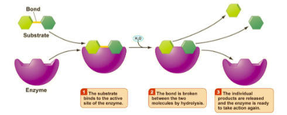

### mouth 
- mechanical digestion  
    - chewing  
- chemical digestion  
    - enzyme: salivary amylase (CHO)  
    - enzyme: lingual lipase (FAT)  
- chewed up food + saliva = bolus  

### esophagus 
- swallowing  
- reflux occurs when the lower esophageal sphincter does not stay closed and HCL irritates the esophagus  
- peristalsis: waves of muscular contractions that help move material through the esophagus
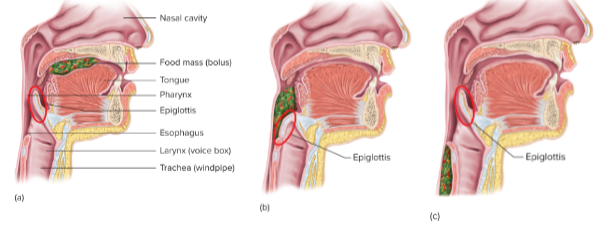  

### stomach
- size: 1 cup (empty) - 1 gallon (very full, usually throw up before hitting this point)  
- lower esophageal sphincter  
- bolus + gastric juices = chyme  
- pyloric sphincter  
- mechanical digestion  
    - peristalsis via strong gastric muscles  
- chemical digestion  
    - hydrochloric acid (HCL) denatures protein  
    - pepsinogen --> pepsin, breaks down protein  
    - gastric lipase breaks down fat  

### pH  
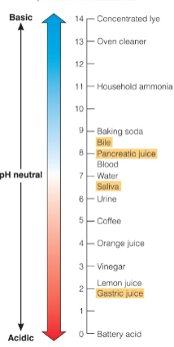  
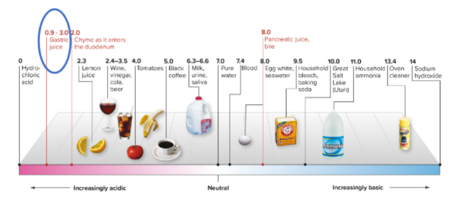  

### gastric secretions  
- mucous cells  
    - mucin + water = mucous (protects the lining of the stomach)  
- chief cells  
    - lipase and pepsinogen  
- parietal cells  
    - HCL, intrinsic factor (needed for absorbtion of b12)  
- G-cells  
    - gastrin, hormone that simulates stomach motility and secretions  
    - targets parietal cells and chief cells  

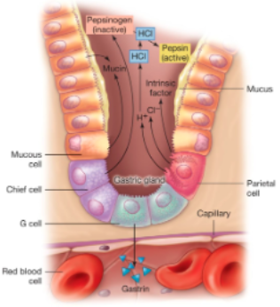

### small intestine  
where most of the digestion/absorbtion of nutrients happens
- duodendum  
    - 10 inches  
- jejunum  
    - 3-5.5 feet  
- ileum  
    - 5-9 feet  
- ileocecal sphincter  

DJI = dont jump in  

- mechanical digestion  
    - peristalsis  
    - segmentation  
- chemical digestion  
    - enzymes secreted from the lining of the small intestince [mucosa] (eg lactase)  
    - secretions from accessory organs  
    
goblet cells produce mucus  
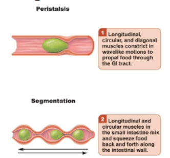

### accessory organs  
- liver  
    - makes bile  
    - synthesizes cholesterol  
- gallbladder  
    - stores bile  
- pancreas  
    - bicarbonate   
        - neutralize acidic stomach contents  
    - amylase (CHO)  
    - peptidases (PRO)  
    - lipase (FAT)  

### Hormonal regulation of digestion  
|prompt | hormone | result|  
|--|--|--|  
|food in stomach | gastrin | stomach motility and gastric gland secretion|  
|acid chyme in the small intestine|secretin|pancreas and liver to release bicarbonate|  
|fat in small intestine|cholecystokinin (CCK)|sceretion of bile and pancreatic enzymes|  

### large intestine (colon)
- size = 5 feet  
- time: stool passes through the colon within 12-70 hours  
- Ileocecal valve  
- cecum  
- ascending colon  
- descending colon  
- transverse colon  
- rectum (6 inches)  
- anus  

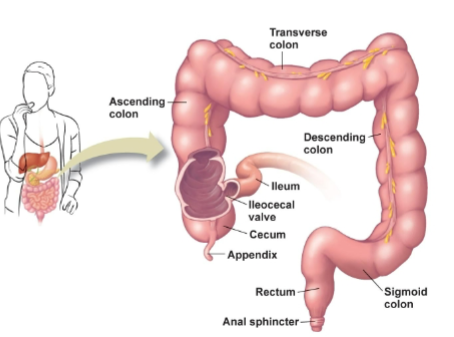  

mechanical digestion:  
- peristalsis  
- secretion of mucous from goblet cells  

chemical digestion:  
- fermentation  

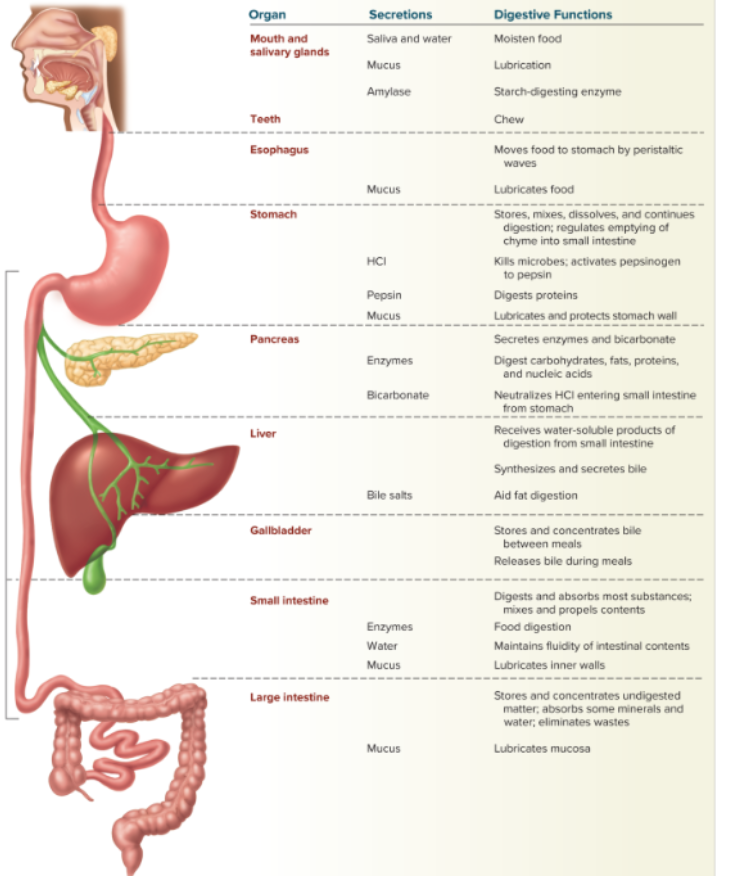

## Absorbtion of nutrients  
- some occurs in the mouth and stomach  
- most absorbtion of nutrients occurs in the small intestine  
- villi and microvilli  
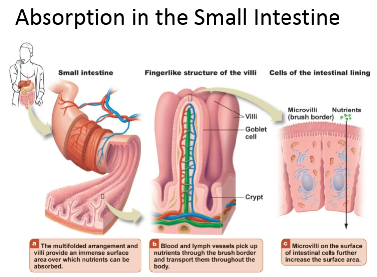  

### absorbtion in the large intestine  
- absorbtion of water and electolytes takes place in the large intestine  
- feces is typically 75% water  
    - remaining material is bacteria and undigested fiber  

nutrient absorbtion can occur by:  
- simple diffusion  
- facilitated diffusion  
- active transport  
- osmosis  
- endocytosis  

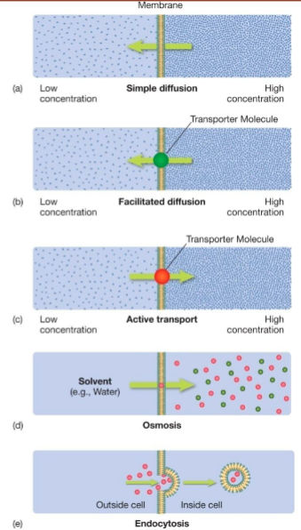  

## Transport  
water soluble nutrients and certain fats are absorbed into the capillary network  
- travel to the liver via the hepatic portal vein  
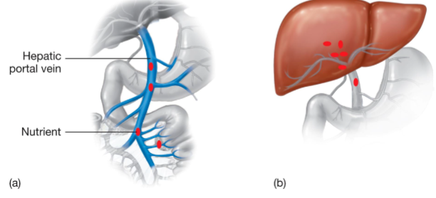  
- water soluble nutrients: intestines --> blood --> liver --> heart --> rest of body
    - folate  
    - biotin  
    - pantothenic acid  
    - vitamin C  
    - vitamin b12  
    - thiamin (b1)  
    - riboflavin (b2)  
    - niacin  
    - pyridoxine (b6)  

- fat soluble nutrients: intestines --> lymph --> heart (blood) --> rest of body  
    - vitamin A  
    - D  
    - E  
    - K  

## Defecation 
expulsion of fecal material from the body  

feces: waste matter discharged from the colon  

## Microbes in the digestive tract  
- the large intestine has vast numbers of various types of bacteria (called the gut microbiota)  
- having a healthy gut microbiota promotes health  
- use of antibiotics to fight bacterial infections can affect gut microbiota  
    - use of probiotics may be beneficial to support restoration of the gut microbiota  

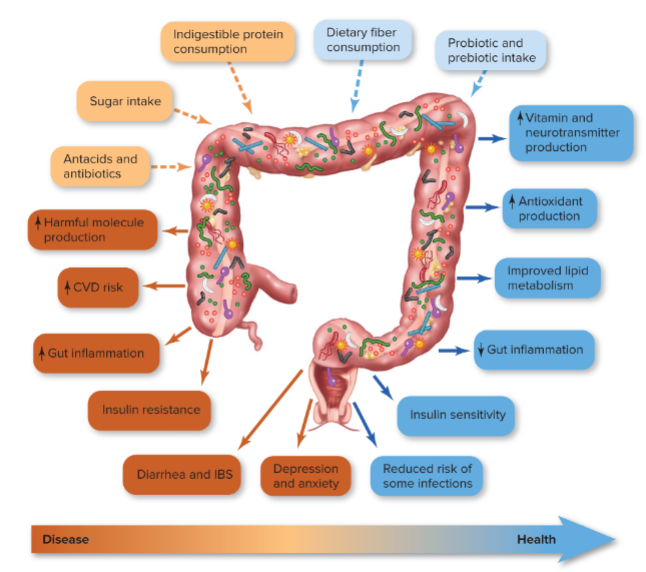  
- may be affected by diet  
    - prebiotics: promote growth of beneficial bacteria like fiber  
    - probiotics: live bacteria that may crowd out bad bacteria in the body  
        - often used to prevent diarrhea due to antibiotic use  
        - e.g. yogurt with live cultures, sauerkraut, supplements  
research regarding probiotics is not conclusive. The gut microbiota is a complex ecosystem, and probiotic needs likely vary from person to person  

- microbes in the digestive tract are beneficial, and functions include:  
    - metabolize undigested food (fermentation)  
    - synthesizes short chain fatty acids  
        - energy used by cells of the colon  
        - may decrease risk of colon cancer  
    - produces vitamin K, folate, B6, B12, biotin, and gas  

## common digestive tract disorders  
- too slow digestion  
    - constipation  
    - may be due to IBS  
- too fast digestion  
    - diarrhea  
    - may be due to IBS/IBD  
- abnormalities in GI wall  
    - diverticulosis/itis  
    - hemorrhoids  
- coming up from the stomach  
    - vomiting  
    - GERD  
- sores in the GI tract  
    - peptic ulcer  
    - crohn's disease (auto-immune; whole GI)  
    - ulcerative colitis  

### Gastroesophageal Reflux disease (GERD)  
- characteristics  
    - chronic reflux of stomach acid into the intestine  
    - may damage the esophagus  
- prevention/treatment  
    - lose excess body weight  
    - do not lie down after eating / elevate the bed  
    - avoid overeating  
    - avoid smoking and secondhand smoke  
    - avoid tight clothing  
    - avoid dietary triggers  
        - alcohol  
        - coffee  
        - chocolate, peppermint, greasy or spicy foods, tomatoes  

### Vomiting  
forcible or involuntary emptying of stomach contents through the mouth  
- avoid solid foods/drink clear liquids until symptoms subside  
- seek medical help if prolonged or if there is blood present  

### Gastric ulcer  
- characteristics  
    - sore in the lining of the stomach or upper small intestine  
    - pain 2 hours after eating  
    - helicobacter pylori is responsible for most cases  
- prevention/treatment  
    - avoid NSAIDs, alcohol, smoking  
    - antibiotics + medications to reduce stomach acid production    
    - avoid spicy foods when an ulcer is present  

### Constipation  
- characteristics   
    - infrequent bowel movements (<3/week) and feces that are difficult to eliminate  
    - risk increased by: antibiotics, medications (including opiates), low fiber diet, low water intake, anxiety, depression, disrupted routines (e.g. surgery or vacation)  
    - may increase risk for hemorrhoids  
- prevention/treatment  
    - increase fiber and water intake  
    - try fermented foods, probiotic/prebiotic supplements  

### Diarrhea  
- characteristics   
    - frequent, watery bowel movements  
    - decreased nutrient absorbtion  
    - loss of electrolytes  
- prevention/treatment  
    - antidiarrheal medications  
    - seek medical help for severe cases (especially for children and older adults), or if blood is present for 7 days

### IBS / IBD  
- IBS = Irritable bowel syndrome  
- IBD = inflammitory bowel disease  
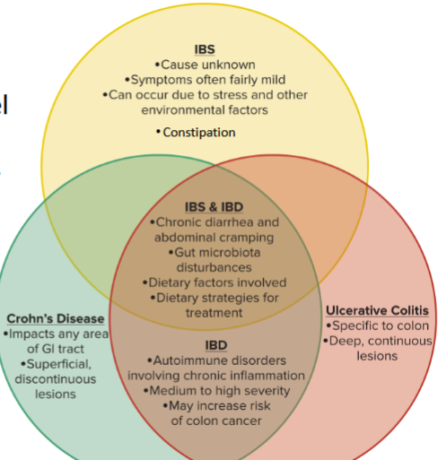

### Diverticulosis/itis  
- diverticulosis: tiny pouches (diverticula) that form in the inner lining of the large intestine and push through weak regions of the colon wall  
- diverticulitis: inflamed diverticula due ti infection from bacteria or feces  
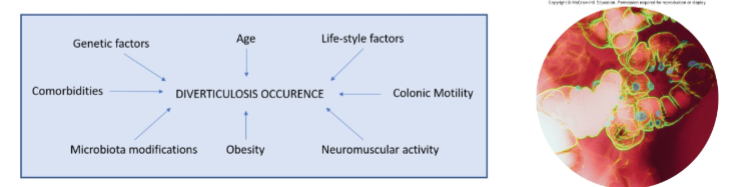

## Bile
chyme is mostly water, so it does not mix with hydrophobic fat well. Bile helps this problem.  

Bile is made in the liver, stored in the gallbladder, and released into the duodenum when fat being present in the small intestine stimulates the production of cholecystokinin (CCK). 

Bile is an emulsiphier because it is amphipathic (one side is hydrophylic [orients towards chyme] and the other is hydrophobic [orients towards fat]). This turns large fat droplets into smaller droplets as the droplets get surrounded by bile and broken down by the lipase present in the chyme.
# Exam 1 study

## ch 1 - know

### 1.2 the nutrients  
six classes of nutrients:  
- carbs  
    - major energy source  
    - maintain blood glucose levels  
    - eleimante solid waste from gastrointestinal tract (fiber)   
- lipids (fats and oils)  
    - major source of energy  
    - cell development, physical growth  
    - regulation of body processes (some hormones)  
    - growth and development of brain  
    - absorbtion of fat soluable vitamins  
- proteins  
    - formation of structural (muscle fibers) and functional (enzymes) components  
    - cell development, growth, and maintenance  
    - regulation of body processes (some hormones)  
    - transportation of substances in the blood  
    - minor source of energy  
- vitamins  
    - regulation of body processes  
    - immune function  
    - production and maintenance of cells  
    - protection against agents that can damage cell components  
- minerals  
    - regulation of body processes (fluid balance, energy metabolism)  
    - formation of some chemical messengers  
    -  formation of structural/functional components (various substances and tissues)  
    - cell development, growth, maintenance  
- water  
    - maintenance of fluid balance  
    - regulate temperature  
    - eliminate wastes  
    - transport substances 
    - participates in many chemical reactions  

typically, a body is 50-70% water. In young people most levels are about the same, but young women have less water and protein, and more fat.  

Almost 98% of the body is made up of oxygen, carbon, hydrogen, nitrogen, or calcium.  

|| carbon | hydrogen | nitrogen | oxygen | phosphorus|sulfur | others|   
|--|--|--|--|--|--|--|--|  
|carbs| o | o | | o | | | |  
|lipids | o |o|X|o|X| | |  
|proteins| o|o|o|o| |X| |  
|vitamins| o|o|X|o|X|X| cobalt|  
|minerals| | | | | X|X| sodium, magnesium, potassium, calcium, chromium, iron, copper, zinc, iodine, and others|  
|water| |o| | o| | |  

o = all nutrients in this class contain this element  
X = some nutrients in the class contain this element  

organic = contains carbon (carbs, lipids, proteins, vitamins), inorganic = no carbon (water, minerals)  

Essential nutrients are dietary necessities because the body cannot make them (such as water) and a lack results in signs or symptoms of disease. Signs = measurable (rashes, atypical growth, elevated blood pressure) while symptoms = subjective complaints of ill health (dizziness, fatigue, headache).  
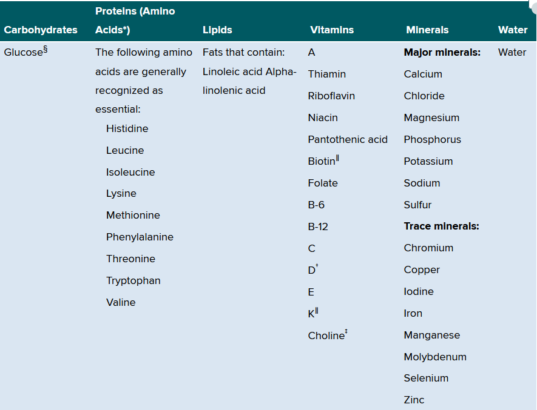  

Conditionally essential nutrients can become essential under certain conditions when the body cannot make adequate amounts (ex: during metabolic disorders, serious diseases, prenatal development)  

Carbs, fats, and proteins are macronutrients (energy sources), while vitamins and minerals are micronutrients. water is not classified as a macronutrient since it doesn't provide energy.  

### 1.3 food as fuel  
calorie = 1g(mL) water raised by 1 degree C  
Calorie or kcal = 1L water raised by 1 degree C  

direct calorimetry means to burn the food and measure the energy output.  

| 1 gram of | kcals|  
|--|--|  
|carbs| 4|  
|protein | 4|  
|fat | 9|  
|alcohol| 7|  

### 1.4 risk factors  
Risk factors = attribute/characteristic/exposure that increases a person's chances of developing a chronic disease (such as heart disease, diabetes, cancer).  

Genetic makeup does not entirely determine a person's likelihood of developing these issues, lifestyle is also a large part (unsafe environmental conditions, psychological factors like stress, social determinants of health equity, lack of access of healthcare/food, advanced age, etc).  

Perform 60+ minutes of physical activity for every 8 hours of sedentary activity.  

### 1.5 expert advice  
registered dietician nutritionist or registered dietician = college trained health care professional with a master's degree. 

### 1.6 concepts 1,2,5  
#### concept 1
nutrient dense foods provide more key nutrients (protein, fiber, vitamins, minerals) in relation to total calories per serving, and has little to no solid fats/added sugars/refined starches/sodium.  
Ex of nutrient dense foods = vegetables, low fat milk, fruits, lean meats, whole grain cereals  

energy dense foods have a kcal to weight ratio of 4+. Fat supplies most energy per gram. These foods also tend to not be water dense.  

foods can be both nutrient and energy dense! like nuts. But a lot of energy dense foods are also kind of empty calories
#### concept 2  
variety is important in diet, but so is moderation. A healthy diet meets all the nutritional needs, and *then* can add in the occasional empty calories treat for enjoyment.

myPlate food groups = fruits, grains, vegetables, protein, dairy  

#### concept 5
malnutrition = body is improperly nourished. This can be from over or under nutrition.  

## ch 1 - skim

### 1.1 importance of nutrition  
important to study nutrition because it is the study of nutrients and how the body uses them. We should be informed about nutritional values, and impact of diet/food choice patterns can have on health.  

### 1.2 phytochemicals table  
plant made non-nutrients that may have health benefits.  
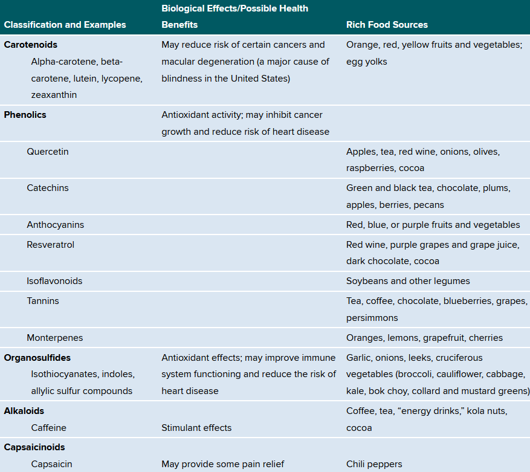  

### 1.5 factors that influence eating  
- biological and physiological factors: life stage  
    - young children get pre selected foods from caregivers  
    - young adults typically branch out as they leave home  
    - older adults may have health conditions that require changes in food choices  
- cognitive and psychological factors: learning processes  
    - past experiences  
    - cultural practices  
    - religious teachings  
    - stress level and mood  
- environmental factors  
    - proximity to store/food/cooking  
    - government policies, food distribution, food marketing  

### 1.6 concepts 3,4,6  
#### concept 3  
focusing your diet on primarily minimanlly-processed foods is best when possible, as processing can remove some beneficial nutrients and phytochemicals.  
Some people have conditions that require them to take supplements to get the needed amounts of nutrients.  
Note: supplements do not need to be tested before being marketed, and are not regulated as strictly as medications by the FDA.  

each nutrient has a safe intake range (physiological dose = ideal). When taken in high levels, many vitamins behave like drugs and can produce unpleasant and even toxic side effects. Compared to vitamins, most minerals have a vary narrow range of safe intake.  

#### concept 4
nutrient consumption is not a cure all for health issues. It can help some things like nutrient deficiencies, but diet is only one of many factors that impact a person's long term health.  

#### concept 6  
Nutrition is a dynamic science that we are constantly learning more about, so recommendations from professionals may change over time.

## ch 2 - know
