# Human-Nutrition
# **08/28/2025**
    exams will be open from tues to sat on the week they are due, get 2 attempts on the final

    ## intuitive eating: finding moderation with food
    ### why diet mentality doesnt work
        - externally motiviating instead of intrinsically motiviating
        - ppl tend to make drastic changes in their food intake and lifestyle, which makes it hard to adjust to
        - seen as temporary, strict changes that are not meant to be sustainable
        - focuses on taking away instead of adding to 
        - label foods as 'good' or 'bad'
        - don't get to the root of the problem (ex: sedentary lifestyle, causes of overeating (habits, trauma), underlying health issues such as hormone imbalances)
        - diets are difficult to take on the road, or to upkeep in busy lifestyle 
        - focuses on weight loss, not wellness. this can lead to more weight being gained than was lost during the diet

    ### intuitive eating focuses on additions rather than subtractions
        - adding eating times (optimal every 3-4 hours)
            even if it a small amount of food, this can help people feel properly fueled
            this can also depend on the person, and how much they eat at once. some people feel better with more small meals, and some would rather have a few larger ones
        - variety helps the food feel interesting and exciting
            meals = 3 food groups
            snacks = 2 food groups
        - fruits and veggies tend to be underrepresented in a lot of american's diets
        - water! chronic dehydration is A Thing
        - physical activity, 1 hr for every 8 hours sedentary
    
    ## understanding hunger and fullness
        0   : empty  
        1.5 : ravenous  
        3   : weak  
        4   : pangs  
        5   : neutral  
        6.5 : satisfied  
        8   : full  
        9   : stuffed  
        10  : sick  

        goal is to stay between 3-7, and going to one of the extremes can cause you to swing to the other extreme

    ### strategies to notice fullness
        - the food stops tasting as good, not getting enjoyment from it, texture starts to bother you
        - take mini breaks when eating
        - learn from history (if you get a serving of food and feel too full after eating it, make a mental note that next time you would prefer a smaller serving)
    
    ### emotional eating
        ask yourself:
            am I hungry?
            how am I feeling?
            what do I need?
        it's not that we can never eat when we aren't hungry, but it shouldn't be a frequent thing or get to the point of impacting our feelings of wellness
        top reasons for emotional eating: boredom, stress, lonely, tired, want a reward, habits/environmental queues  

    **power snacks:** ideally want to have a protein (lasting energy) and a carb (quick energy)

    *key note:* food does not have a moral value! there are not 'good' vs 'bad' foods, and you are not good or bad for eating foods. All foods can have a place in a balanced diet, but some are 'sometimes' foods that do not provide as much value to you

    ### body acceptance
        negative filtering: focusing on a negative aspect to the point that is drowns out all other things
            tip: leave with one good thing (before starting your day, or each time you think about your body, end with a positive thing)
            focus on what your body can do

# **09/02/2025** ch 1

- nutrients are life sustaining substances found in food
    necessary for growth, maintenance, and repair of body cells

- nutrition is the scientific study of nutrients and how the body uses them

## why study nutrition?
- poor dietary practices are associated with obesity and type II diabetes
- healthy diets support longer, healthier lives

## characteristics of nutrients
the nutrients:
- vitamins
- minerals
- fat
- protein
- carbohydrates
- water

nutrients are sources of elements (substance that cannot be separated into simpler substances by ordinary chemical or physical means) needed by the body
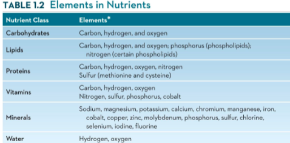

### ways to classify nutrients:
- organic (contains carbon)
- non essential (nutrients synthesized in the body from raw materials from food)
- essential (must come from food)
- energy yielding

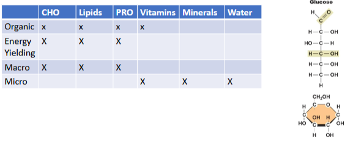

### six classes of nutrients

vitamins: organic, found in produce and grains

minerals: major (large amounts, such as calcium in teeth, rec 1200 mg/day) or trace (smaller amounts, such as iron in red blood cells, rec 8-30 mg/day)

fat: organic, energy yielding, helps the body insulate and protect itself

protein: organic, can be from plant of animal sources, important role in muscle building and maintenance, hormones are also protein

carbs: organic, energy yielding, preferred fuel source for brain and muscles, found in fruit/grains/dairy products

water: found in all drinks and most foods, important for cooling and cushioning in the body, helps remove waste from the body

### phytochemicals
- substances in plants that are not nutrients but may have health benefits
    - caffine
    - beta-carotene
    - organosulfides
    - nicotine (not beneficial)

### deficiency
- deficiency disease occurs when the body lacks a nutrient
- signs: observable physical changes (such as bleeding gums for vitamin c deficiency)
- symptoms: subjective complaints of ill health (tiredness for iron deficiency) 

## calories vs Calories
a calorie is the amount of heat needed to raise the temp of 1mL of water 1 degree C
    - this is a very small unit if measurement, so food energy is measured in 1000 calorie units

a kilocalorie (or Calorie) is the heat energy needed to raise 1L of water 1 degree C

### example: apple
1 apple = 40,000 calories = 40 kcals = 40 Calories

## energy yielded from nutrients
1g carbs = 4 kcals  
1g protein = 4 kcals  
1g fat = 9 kcals  
1g alcohol = 7 kcals  
1g lipids = 9 kcals  

## **Lifestyle factors that impact health**

### Chronic Disease
Chronic diseases are long term conditions that usually take years to develop and have complex causes.  
- heart disease
- diabetes
- cancer

### Risk Factors
Risk factors are personal characteristics that increase a person's chances of developing a chronic disease.  

- family history  
- unsafe environmental conditions  
- psychological factors  
    - emotional stress  
- social determinants of health  
    - access to good food and healthcare  
- advanced age  
- unhealthy lifestyle  

**General rule:** for every 8 hours of sedentary time, do 1 hour (or more) of physical activity

being sedentary for more than 8 hours a day without physical activity has a mortality risk comparable to smoking :(

### 'healthy people 2030' project
This project is a list of goals (updated every 10 years) issued by the department of health and human services to promote health and prevent disease.

main takeaways for 2030:  
- limit food and beverages high in added sugars, saturated fat, and sodium  
- increase intake of fruit, vegetables, whole grains, calcium, potassium, vitamin D  

## factors that influence eating habits

- what was the last thing you ate today?  
    - WHERE were you?  
    - WHO were you with?  
    - HOW hungry were you?  
- what factors influenced  
    - WHAT you ate?  
    - WHY you ate?  
    - HOW much you ate?  

### Biological and physiological factors
- sensory information  
- rate of growth (increased hunger levels)
- things like budget, time available for cooking, general health, etc  

### Cognitive and psychological factors
- past experiences  
- cultural practices  
- religious teachings  
- things learned at school, home, media, internet  
- emotional stress level and mood  
- positive and negative associations  

### Environmental factors
- cost  
- proximity/accessibility to food/stores/kitchen  
- government policies (subsidization)  
- food distribution and availability  
- food marketing  
- store layout  

### Expert advice factors
- registered dietitian nutritionists  
    - college trained healthcare professional who has extensive knowledge of foods, nutrition, dietetics, and the application of nutrition and food info to achieve and maintain optimal health
- master's degree 
- extensive supervised practice hours  
- pass national registration exam  
- complete ongoing continuation education  

## Key nutrition concepts
- most foods are mixtures of nutrients  
- variety, moderation, and balance can help ensure a diet's nutritional adequacy  
- food is the best source of nutrients  
- foods and the nutrients they contain are only one of many components of health  
- malnutrition includes overnutrition as well as undernutrition  
- nutritian is a dynamic science

### nutrient density
nutrient dense foods have:
- more key nutrients relative to its total kcal per serving  
- less solid fat, added sugars, refined starches  

to find the nutrient density, divide the amount of nutrients by the kcals.  
ex:  
whole milk has 300mg calcium / 140 kcals = 2.14 mg Calcium per kcal  
skim milk has 300 mg calcium / 80 kcals = 3.75 mg Calcium per kcal  

### energy density
- amount of energy (kcals) a food provides per given weight of food  
- energy dense food often have empty kcals (kcals from unhealthy solid fats and added sugars)

# **9/9/2025**, ch 1 cont.
participation points (must have 100 pts by end of semester) can be from attendance, cooking demos on campus (have to register for these), or a 1 on 1 dietician consultation (also have to sign up for a time slot). Can only get points for 1 demo/session a month.

## Calendar check in: 
    assignment 2 and workbook 2 are due this saturday
    first exam is due on sat sep 27th, will open on the 23rd. open book open notes, but check if need to print/email to yourself, etc
    resources page has study guides, practice questions, and a practice exam

## variety, moderation, balance  
- variety: each food group  
- moderation: reasonable amounts  
- balance: supports maintenance of a healthy weight  

## food is the best source of nutrients

| Food | Supplements  |
|----------|----------|
| efficient| convenient   |
| relatively inexpensive    | may fill a nutrient need   |
| contains a mix of nutrients | not regulated by FDA prior to being sold on the market |
| contains phytochemical, etc. | expensive |
| | may contain only one nutrient|
| | high amounts of one nutrient may decrease absorbption of another |

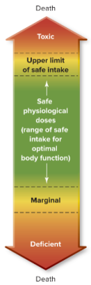

## Malnutrition: under *and* overnutrition
- malnutrition: a state of health that occurs when the body is improperly nourished  
- there are risks with excessive intake *and* under consumption  
- nutritional status does not always correlate with weight  

what are risk factors for malnutrition?
- food deserts or insecurity   
- allergens or food restrictions  
- eating disorders or psychological factors  
- chewing problems  
- limited access to food  

## Nutrition is a dynamic science
- research continues to evolve  
- as such, nutrition recommendations do as well   
- individual needs may vary  

## end of chapter 1, review question
### which of the following is *not* a key nutrition concept?
a. Foods and the nutrients they contain are not cure-alls.  
b. ***The best way for people to obtain all the essential nutrients is
to consume dietary supplements.***  
c. Variety, moderation, and balance can help ensure a diet's
nutritional adequacy.  
d. Malnutrition includes over-nutrition as well as
undernutrition.  

# **Ch. 2 Evaluating Nutrition Info**
## The scientific method
1. Observation  
2. Hypothesis  
3. Literature review  
4. Experiment  
5. Analysis and interpretation  
6. Dissemination
7. Conduct more research  

Anecdote = account/testimonial of a personal experience or event

## Follow up questions/evaluating research considerations:
- was the hypothesis supported?  
- do we have enough information to establish a theory?  
- did they have a control group?  
- was there randomization?  
- what is the sample size?
    - typically larger is better  
    - mention of a sample size/power calculation is preferred  
- what is the p-value?  
    - p-value <0.05 indicates statistical insignificance  
        - indicates that there is less than a 5% chance that the findings were due to chance  

## Publishing research
- peer review  
- parts of a research article  
    - abstract  
    - review of literature  
    - methodology  
    - results  
    - conclusions  
    - references  

## sample size / power calculation
- The sample size and power calculation were
calculated on the following assumptions: an
incidence rate in the low-fat group of 4 events per
100 person-years that would amount to 24·9% of
absolute cumulative incidence after 7 years, a
hazard ratio (HR) of 0·7, and statistical power of
80%, with two-tailed α=0·05. Under these
assumptions, the required sample size was 491
patients in each of the two groups

## P-value
- in men...primary endpoints occurring in 67
(16.2%) of 414 men in the Mediterranean diet
group versus 94 (22.8%) of 413 men in the low-fat
diet group (multiadjusted HR 0.669 [95% CI 0.489–
0.915], log-rank p=0.013)  
- There was no differences when comparing the two
diets among women (p=0.25)  

## Review  
A study assesses the change in knowledge following
an educational intervention. Which of the following
groups had a statistically significant improvement in their knowledge?  
A. Older adults (4.5±1.25 to 4.6±1.36, p=0.87)  
B. ***College students (3.9±0.6 to 5.9±1.6, p=0.03)***  
C. High school students (4.1±1.56 to 5.7±5.5,
p=0.51)  
D. Elementary school students (1.2±2.5 to 1.1±3.2,
p=0.67)  

## Types of research studies
### Lab Research: Test tube studies (in vitro)
| Type of study/definition | Pros | Cons |  
|----------|----------|----------|
|Studies performed in a test tube allow scientists to study the effect of a specific nutrient on a specific cell type in controlled environment | controlled environment | results from a test tube may not be observed in a human |  
| | few confounding variables | |   
| | relatively expensive | |  

**Confounding variables** – factors that are not
being studied may influence the outcome of
the research  

### Lab Research: animal studies (in vivo)
| Type of study/definition | Pros | Cons |  
|----------|----------|----------| 
|Because of safety and ethical concerns, nutrition scientists often conduct experiments on animals before performing similar research on humans | preliminary research is done on animals instead of humans | results from animal studies may not be observed in a human study|
| | helps inform future studies with humans| |  

### Lab Research: observational studies
| Type of study/definition | Pros | Cons |  
|----------|----------|----------| 
|Epidemiology is the study of the occurrence, distribution, and factors that may contribute to health problems in populations | inform future experimental (intervention) studies | observational studies cannot establish cause-effect relationships |
|phsical health data | | healthy-user bias |
|surveys | | |

types:
- cross-sectional
- case-control
- cohort

### Observational studies: Cross-sectional
- looking at a "snapshot" of one point in time
- identify factors that may influence disease in a certain population

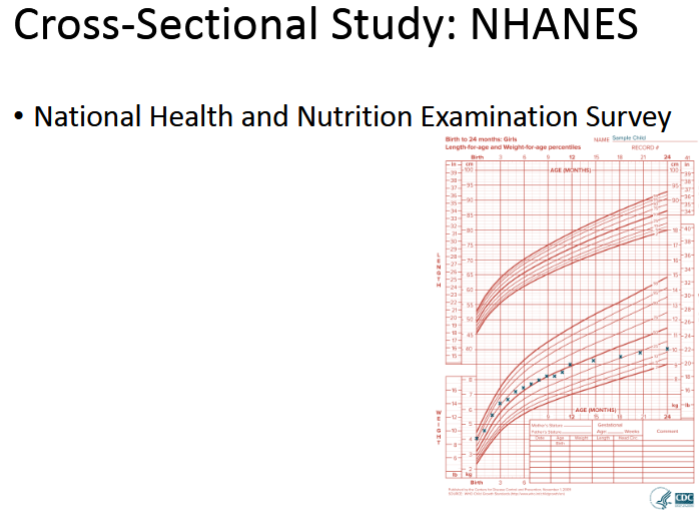
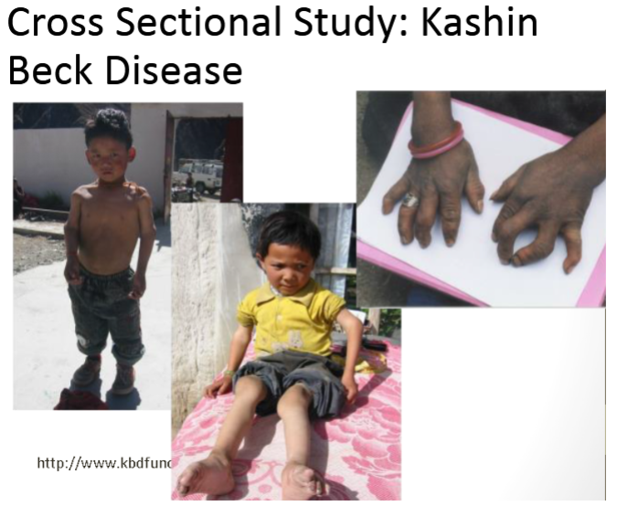

### Observational studies: case control
- individuals with a health condition (cases) are compared to individuals with similar characteristics who do not have the condition (controls)  
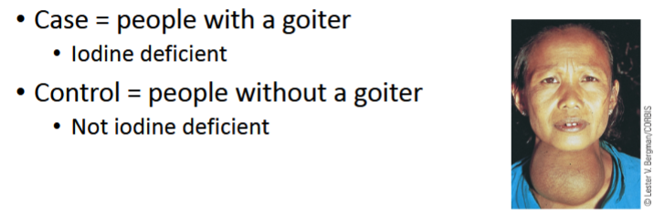

### Observational studies: Cohort
- in a cohort study, epidemiologists collect and analyze various kinds of information about a large group of people over time
    - retrospective or prospective

### Human Research: Experimental studies
| Type of study/definition | Pros | Cons |  
|----------|----------|----------| 
|In experimental studies, cetrain aspects of the diet are changed, and health outcomes are assessed | gold standard = randomized controlled trails (RTCs) | specific inclusion criteria may decrease generalizability |  
|specific inclusion criteria |  | real life does not have controlled, ideal conditions |

# **9/11/2025**

## Correlation types
positive correlation: A and B increase or decrease in the same direction  

Negative correlation: A and B increase or decrease in opposite directions  

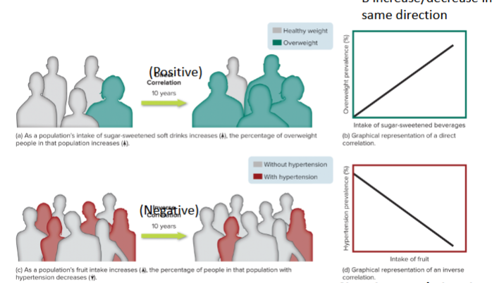  

## levels of research evidence
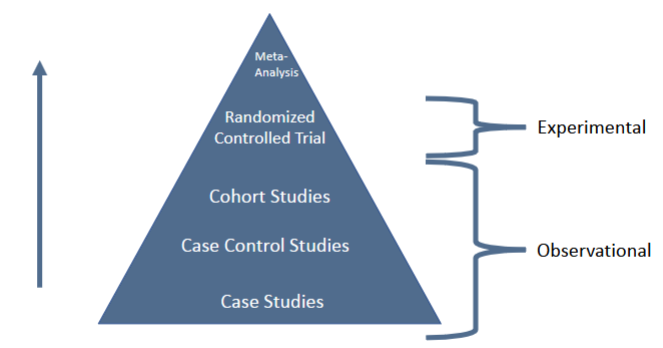  

## Review: what type of study?
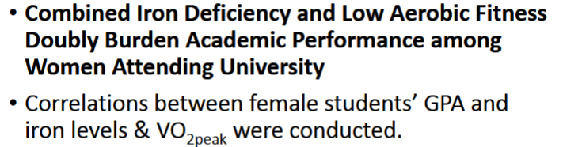  
a: cross-sectional  

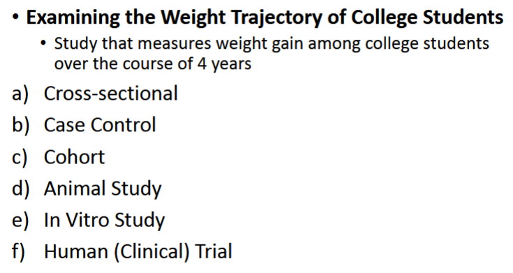  
a: cohort  

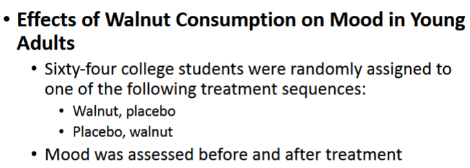  
a: human (clinical) trial  

## Review: what type of correlation?
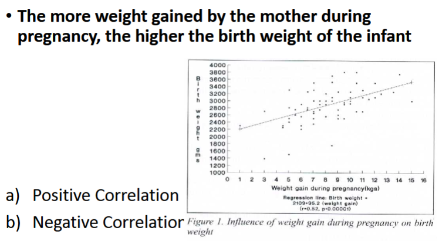  
a: positive correlation  

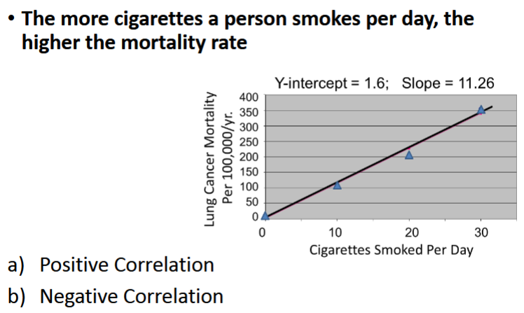  
a: postitive correlation (note that positive correlation does not always mean positive outcome)

## **Nutrition info: fact or fiction**

### Features of unreliable sources of nutrition info
1. promises of quick and easy remedies  
2. claims that sound too good to be true  
3. scare tactics  
4. attacks on conventional scientists and nutrition experts  
5. testimonials  
6. promotion of benefits while overlooking risks  
7. vague, meaningless, or scientific-sounding terms  
8. vague sources  
9. pseudoscience  
10. disclaimers  

### Finding credible sources of nutrition info
- motivation  
    - health promotion vs selling something  
    - .com vs .org or .gov  
    - nationally recognized health organization?  
- source  
    - nutrition expert vs PhD  
    - reviewed by experts vs blogs or magazines  
- evidence based?  
    - references to pertinent, high quality, peer reviewed research?  
        - population similar to me?  

## Review : credible sources of nutrition info
Which of the following is NOT an indication that the source of information is credible?  
a) ***Provides testimonials***  
b) References peer-reviewed journal articles  
c) Can be found at a .edu website  
d) Is written by a registered dietitian  